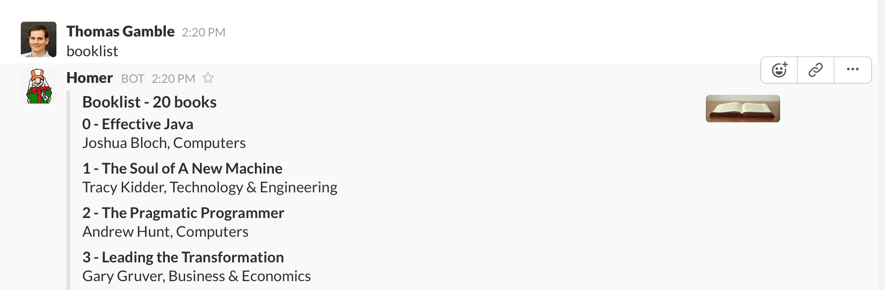

# hubot-book-list


Manages a list of books, using the google books api for data

See [`src/book-list.coffee`](src/book-list.coffee) for full documentation.

## Installation

In hubot project repo, run:

`npm install hubot-book-list --save`

Then add **hubot-book-list** to your `external-scripts.json`:

```json
[
  "hubot-book-list"
]
```

## Sample Interaction

```
hubot booklist
```


